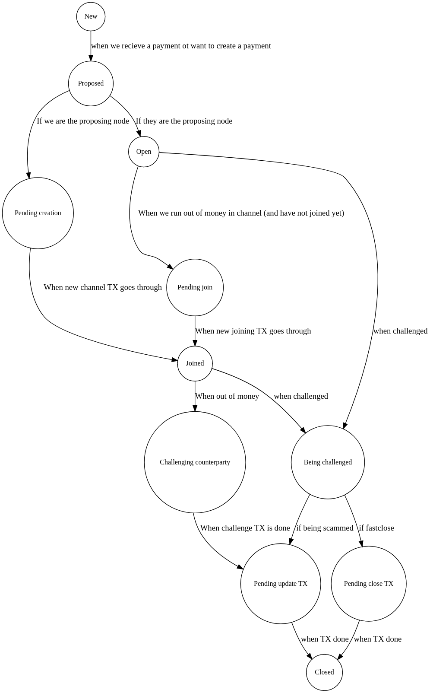

# Graphviz code to generate diagram
```
digraph channel_state {
    rankdir=TB

    node [shape = circle, label="Proposed", fontsize=12] prop;
    node [shape = circle, label="New", fontsize=12] new;
    node [shape = circle, label="Pending creation", fontsize=12] pendc;
    node [shape = circle, label="Joined", fontsize=12] joined;
    node [shape = circle, label="Pending join", fontsize=12] pendj;
    node [shape = circle, label="Open", fontsize=12] open;
    node [shape = circle, label="Open", fontsize=12] pendingoc;

    node [shape = circle, label="Closed", fontsize=12] closed;
    node [shape = circle, label="Challenging counterparty", fontsize=12] initchall;
    node [shape = circle, label="Being challenged", fontsize=12] chall;
    node [shape = circle, label="Pending update TX", fontsize=12] updatetx;
    node [shape = circle, label="Pending close TX", fontsize=12] closetx;

    new  -> prop [label="when we recieve a payment ot want to create a payment"];
    prop -> pendc [label="If we are the proposing node"];
    prop -> pendingoc [label="If they are the proposing node"];
    pendingoc -> open [label="When they tell us the new channel TX goes through"];
    pendc -> joined [label="When new channel TX goes through"];
    open -> pendj [label="When we run out of money in channel (and have not joined yet)"];
    pendj -> joined [label="When new joining TX goes through"];

    joined -> initchall [label="When out of money"];

    open -> chall [label="when challenged"];
    joined -> chall [label="when challenged"];
    initchall -> updatetx [label="When challenge TX is done"];
    chall -> updatetx [label="if being scammed"];
    chall -> closetx [label="if fastclose"];

    closetx -> closed [label="when TX done"];
    updatetx -> closed [label="when TX done"];
}
```