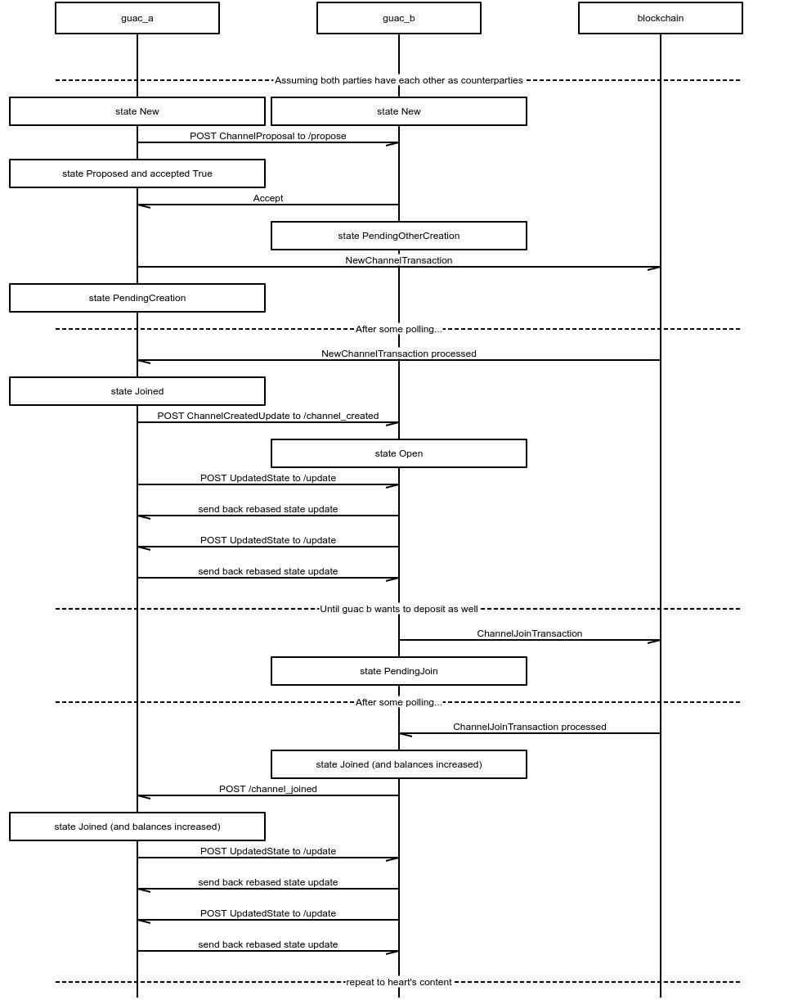

```msc
msc {
  hscale = "2";

  guac_a,guac_b,blockchain;

  ---  [ label = "Assuming both parties have each other as counterparties" ];

  guac_a box guac_a [label="state New"],
  guac_b box guac_b [label="state New"],
   |||;

  guac_a->guac_b [ label = "POST ChannelProposal to /propose" ] ;
  
  guac_a box guac_a [label="state Proposed and accepted True"];

  guac_a<-guac_b [ label = "Accept" ] ;

  guac_b box guac_b [label="state PendingOtherCreation"];

  guac_a->blockchain [ label = "NewChannelTransaction" ] ;
  
  guac_a box guac_a [label="state PendingCreation"];
  
  ---  [ label = "After some polling..." ];

  guac_a<-blockchain [ label = "NewChannelTransaction processed" ] ;

  guac_a box guac_a [label="state Joined"];

  guac_a->guac_b [ label = "POST ChannelCreatedUpdate to /channel_created" ] ;

  guac_b box guac_b [label="state Open"];

  guac_a->guac_b [ label = "POST UpdatedState to /update" ] ;
  guac_a<-guac_b [ label = "send back rebased state update" ] ;

  guac_a<-guac_b [ label = "POST UpdatedState to /update" ] ;
  guac_a->guac_b [ label = "send back rebased state update" ] ;

  ---  [ label = "Until guac b wants to deposit as well" ];

  guac_b->blockchain [ label = "ChannelJoinTransaction" ] ;

  guac_b box guac_b [label="state PendingJoin"];
    ---  [ label = "After some polling..." ];
  guac_b<-blockchain [ label = "ChannelJoinTransaction processed" ] ;
  
  guac_b box guac_b [label="state Joined (and balances increased)"];

  guac_a<-guac_b [ label = "POST /channel_joined" ] ;
  
  guac_a box guac_a [label="state Joined (and balances increased)"];

  guac_a->guac_b [ label = "POST UpdatedState to /update" ] ;
  guac_a<-guac_b [ label = "send back rebased state update" ] ;

  guac_a<-guac_b [ label = "POST UpdatedState to /update" ] ;
  guac_a->guac_b [ label = "send back rebased state update" ] ;
    ---  [ label = "repeat to heart's content" ];

}
```